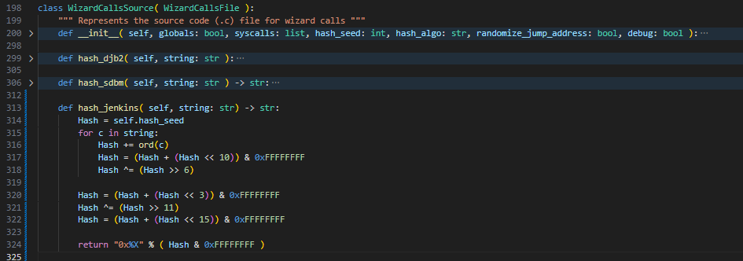
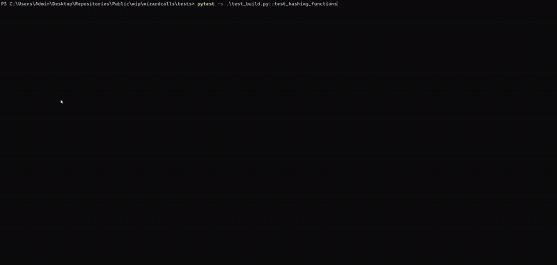

# Adding new hashes to the module
This document describes how new hashes are added to the the wizardcalls module. In this example, we'll be adding support for the [Jenkins One At A Time Hashing algorithm](https://github.com/vxunderground/VX-API/blob/main/VX-API/HashStringJenkinsOneAtATime32Bit.cpp) from the [VX-API](https://github.com/vxunderground/VX-API/).

## Step 1; Choose a name for the algorithm
This name will be used by the **WizardCallsSource** object to identify the hashing algorithm to compile into the template. In this example, we're choosing the name **jenkins**.

> [!IMPORTANT]  
> This name will be used at the command line or in a script when setting the algorithm for the template.

## Step 2; Create the hashing functions in C & Python
In this example, we've chosen to source the [Jenkins One At A Time hashing algorithm](https://github.com/vxunderground/VX-API/blob/main/VX-API/HashStringJenkinsOneAtATime32Bit.cpp) from the [VX-API](https://github.com/vxunderground/VX-API/). The source code is shown below.

> [!IMPORTANT]  
> For the C function, we'll need to define two functions capable of accepting ANSI & wide characters. In some instances, the body of each function can remain the same & only the parameter definition needs to be different.

###### VX-API Jenkins One At A Time hashing algorithm
```c
#include "Win32Helper.h"


UINT32 HashStringJenkinsOneAtATime32BitA(_In_ LPCSTR String)
{
	SIZE_T Index = 0;
	UINT32 Hash = 0;
	SIZE_T Length = StringLengthA(String);

	while (Index != Length)
	{
		Hash += String[Index++];
		Hash += Hash << 10;
		Hash ^= Hash >> 6;
	}

	Hash += Hash << 3;
	Hash ^= Hash >> 11;
	Hash += Hash << 15;

	return Hash;
}

UINT32 HashStringJenkinsOneAtATime32BitW(_In_ LPCWSTR String)
{
	SIZE_T Index = 0;
	UINT32 Hash = 0;
	SIZE_T Length = StringLengthW(String);

	while (Index != Length)
	{
		Hash += String[Index++];
		Hash += Hash << 10;
		Hash ^= Hash >> 6;
	}

	Hash += Hash << 3;
	Hash ^= Hash >> 11;
	Hash += Hash << 15;

	return Hash;
}
```

### Creating the C function

Some modifications will be required to make this compatible with wizardcalls. The changes are listed below..
- Changed returned type from **UINT32** to **DWORD**
- Replaced **StringLengthA** & **StringLengthW** functions with inline code.
- Changed the function name to **HashStringJenkinsOneAtATime**
- Set **Hash** variable to **HASH_SEED** macro. 

> [!IMPORTANT]
> The initial seed for the function MUST be set to the **HASH_SEED** macro. This is how the wizard calls template identifies the correct seed for the algorithm.

> [!IMPORTANT]  
> No #include statements are required in the hashing template file. Only include the two hashing functions.

The final template for the wizardcalls compatible jenkins hashing algorithm is shown below.

###### Wizardcalls compatible version
```c
DWORD HashStringJenkinsOneAtATimeA(_In_ LPCSTR String)
{
	SIZE_T Index = 0;
	DWORD Hash = HASH_SEED;
    SIZE_T Length = 0;
    LPCSTR String2;
    
    for (String2 = String; *String2; ++String2);
	Length = (String2 - String)

	while (Index != Length)
	{
		Hash += String[Index++];
		Hash += Hash << 10;
		Hash ^= Hash >> 6;
	}

	Hash += Hash << 3;
	Hash ^= Hash >> 11;
	Hash += Hash << 15;

	return Hash;
}

DWORD HashStringJenkinsOneAtATimeW(_In_ LPCWSTR String)
{
	SIZE_T Index = 0;
	DWORD Hash = HASH_SEED;
    SIZE_T Length = 0;
    LPCWSTR String2;
    
    for (String2 = String; *String2; ++String2);
	Length = (String2 - String)

	while (Index != Length)
	{
		Hash += String[Index++];
		Hash += Hash << 10;
		Hash ^= Hash >> 6;
	}

	Hash += Hash << 3;
	Hash ^= Hash >> 11;
	Hash += Hash << 15;

	return Hash;
}
```

We'll need to add this template file to the [templates](../../../src/wizardcalls/rsrc/code/templates/) directory. In this example, we've chosen the filename **Jenkins**. Be sure to use the **.c** extension.

###### The new template file for the Jenkins hash


### Creating the python function

Now, we'll need to create a corresponding function in python that produces the same hash as the C function. This code is shown below.
###### The corresponding python function
```py
def hash_jenkins( self, string: str) -> str:
    Hash = self.hash_seed
    for c in string: 
        Hash += ord(c)
        Hash = (Hash + (Hash << 10)) & 0xFFFFFFFF
        Hash ^= (Hash >> 6)

    Hash = (Hash + (Hash << 3)) & 0xFFFFFFFF
    Hash ^= (Hash >> 11)
    Hash = (Hash + (Hash << 15)) & 0xFFFFFFFF

    return "0x%X" % ( Hash & 0xFFFFFFFF )
```

When writing this hashing function, you'll need to make it compatible with the **WizardCallsSource** object. To do this, perform the following:
- Use the function name syntax **hash_$ALGONAME**
- Set the seed variable to **self.hash_seed**
- Return the hash as a hex formated string denoted by **0x**

> [!CAUTION]  
> Ensure the C & python functions produce the same hash or else things will break. This critical, very critical. Don't skip this testing!

## Step 3; Updating wizardcalls core
The next step is updating [core.py](../../../src/wizardcalls/core.py) to accept the algorithm.

### Add hashing function template file path
At the top of the file, add a global variable for the file path of the new hashing function template you created the in the **Step 2**. In the example, we're using the name **JENKINS**.

> [!IMPORTANT]
> The name of this file should be the name of the file you created the in the **step 2** for the hashing function template.

###### Exmaple path code & adding the code
```py
JENKINS = os.path.join( os.path.dirname( os.path.abspath( __file__ ) ), 'rsrc', 'code', 'templates', 'Jenkins.c' )
```


### Add the hashing function as a method to WizardCallsSource
Locate the WizardCallsSource object & add the python hashing function you created in **step 2** as a method of the object.

###### Adding the method to WizardCallsSource object 


### Update the hash algorithm initialization match statement
In the objects constructor function, add a new case for the algorithm.

> [!IMPORTANT]
> The case should match on the name of the algorithm you chose in **step 1**. In this example, we'll match on **jenkins**.

Perform the following:
- Set **hash_algo** to the new hashing method. The example has set the function to **hash_jenkins**.
- Set **hash_function** to the name of the hashing function defined in the C template file. This example renamed the function to **HashStringJenkinsOneAtATime**. **STRIP THE CHARACTER IDENTIFIER. DO NOT INCLUDE THE A OR W IN THE FUNCTION NAME.**
- Set **hash_function_code** to the global variable defined for C template file path. In this example, it's been set to **JENKINS**.

###### Adding the algorithm to the match statement flow


## Step 5; Testing the changes
Fincally, we'll need to test the changes to the code.

In [test_build.py](../../../tests/test_build.py), locate the **test_hashing_functions** function. Add the name of the algorithm to this array. In this example, we've added the **jenkins** name which was defined in **step 1**.


Now, we need to test the algorithm. If everything is working correctly, we should see a calculator pop & print statement confirming the algo test passed.

To perform the test, navigate to the [tests](../../../tests/) directory and execute the command below.
```
pytest -s .\test_build.py::test_hashing_functions
```
###### Running the hash test


In the output, we can see **Passed jenkins hashing algo test** indicating everything is working. If the test failed or a calculator didn't pop, then you messed up somewhere. Go back & fix :)

## Step 6; Updating the command line interface
If all tests were successful, we'll need to add an option to the **--algo** argument for the new algorithm.

In [args.py](../../../src/wizardcalls/args.py#L63), locate the **algo** argument and add the new hash argument name to the **choices** parameter.

###### Adding the 'jenkins' argument to **algo**
