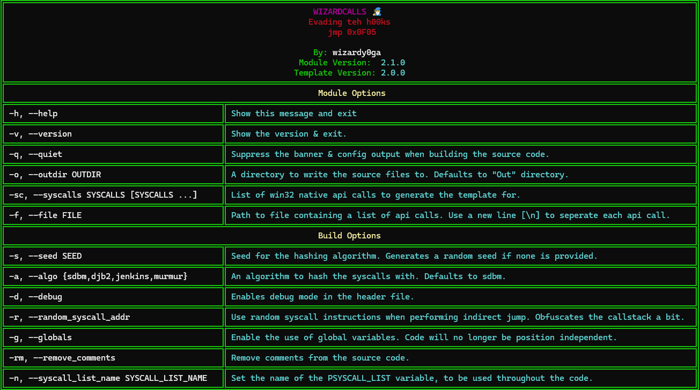

# Using wizardcalls from the command line
Wizardcalls provides the option to generate templates from the command line. This documentation describes the various command line options available for developers.

## Command Line Options
The table below provides extended inforamtion about important command line options.

### -sc, --syscalls
This is the most important argument. This argument is a list of syscalls which wizardcalls will build into the template. All of these syscalls will become accessible in the final template.

### -f, --file
Aside from **--syscalls**, developers can use this argument to feed wizardcalls a list of syscalls from a file. **Each syscall in the file should be seperated by a new line**.

### -o, --outdir
Instructs wizardcalls to write the source code files to a specific directory. This enables developers do write the files directly to their project directory.

> [!NOTE]
> By default, wizardcalls will write the source files to the current working directory. 

### -r, --random_syscall_addr
Instructs wizardcalls to use the memory address of a random system call when executing a syscall. This allows for a bit of call stack obfuscation by masking the return address of the syscall. 

### -g, --globals
Makes the **SYSCALL_LIST** structure globally accessible, allowing the structure to be accessed anywhere in your implants code base. Without this, developers will need to pass around a reference to a structure or initialize & cleanup the structure when needed.

### -n, ---syscall_list_name
Sets the name of the **SYSCALL_LIST** pointer variable. Developers will use this variable name when accessing the structure in their code. The name is set via macro which referenced internally within wizardcalls in key areas where the name of this structure must be the same. Using a macro for the name of the variable offers a level of control over this, allowing wizardcalls to operate as intended.

### -a, --algo
This sets the hashing algorithm for use during function address resolution. The function names will be hashed & compared against corresponding function name hashes of this algorithm.